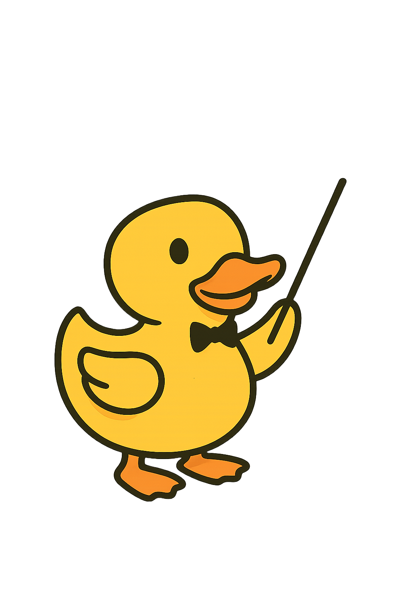

  

# conDAQtor: Directing the lab orchestra

**The problem**

The home-written software that labs need to acquire data determines the possibilities of the experiment. 
Knowledge about such software is not shared between PhD generations or research groups, resulting in a lack of continuity and time-consuming duplicated efforts.

**My goal**

Make research more efficient by offering support and training to researchers, while building a national network for knowledge transfer according to FAIR principles.

**Expected results**

Faster, more advanced experiments. Improved software reusability, and a strong network of labs that accumulate and share expertise.

**How you can help the project**

Provide feedback on the feasibility of the project, and support for the next steps towards realizing the project through a funded position.

---

You can also find here some information and a survey aimed at researchers.

## 📄 Information

- **[conDAQtor_extra](files/conDAQtor.pdf){: .pdf-link }** – More info on what's data acquisition software and the conDAQtor project
  
## 🌐 Survey
- **[Survey for researchers](https://forms.gle/NLs4aToFRWEDVoCq7){: .external-link }** – Please feel free to fill it in, we'd really appreciate it!
- **[Privacy notice](files/survey_privacy_notice.pdf){: .pdf-link }** - Here you can find the survey privacy notice.

## Contact

ana.caballo@proton.me
