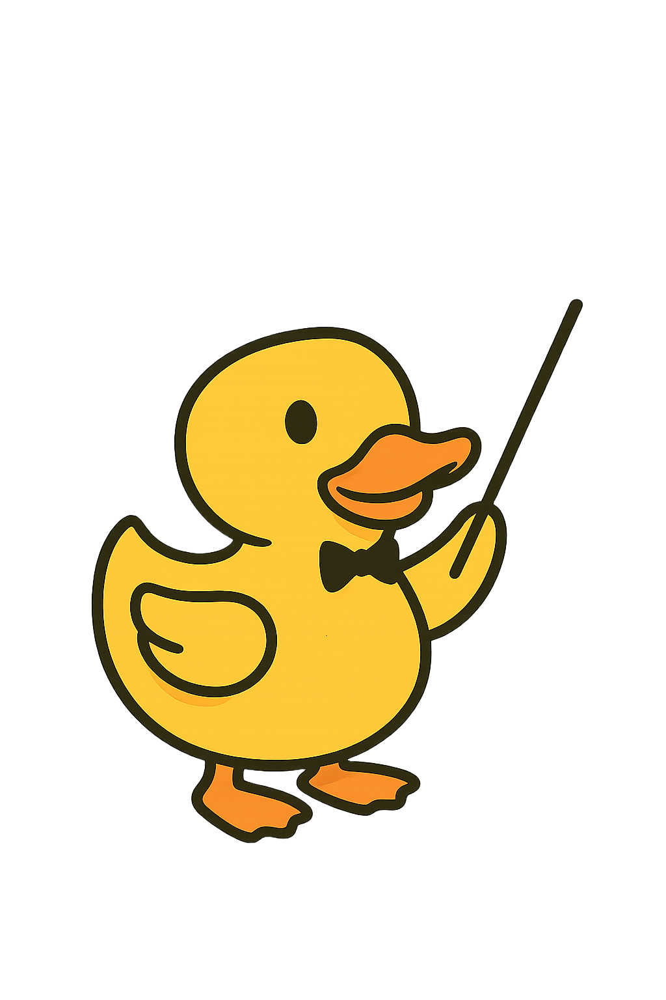

  

**The problem**

The home-written Data Acquisition (DAQ) software that labs need to acquire data determines the possibilities of the experiment. Therefore, it is key for researchers. However, 
knowledge about such software is often not shared between research groups or even between PhD generations, resulting in a lack of continuity and time-consuming duplicated efforts.

**My goal**

Make research more efficient by offering support and training to researchers, while building a national network for knowledge transfer according to FAIR principles.

**Expected results**

Faster, more advanced experiments. Improved software reusability, and a strong network of labs that accumulate and share expertise.

**How you can help the project**

Provide feedback on the feasibility of the project, and support for the next steps towards realizing the project through a funded position.

---

## 📄 Information

- **[conDAQtor info (PDF)](files/conDAQtor_extra.pdf){: .pdf-link }** – More info on what's data acquisition software and the conDAQtor project
  
## 🌐 Surveys
Feedback is key for us to know how our project can help better. We'd really appreciate it if you filled in our surveys and shared them with your colleagues. 
- **[Survey for researchers](https://forms.gle/NLs4aToFRWEDVoCq7){: .external-link }** – This survey is to learn more about the experiences of  anyone who works in a research lab (PhDs, postdocs, scientific staff, technicians, etc)
- **[Survey for group leaders](https://forms.gle/cmeferdwwBxgoQtt5){: .external-link }** – This survey is specifically for group leaders, in their role of decission makers. They're however very welcome to also fill in the general survey above in their role of researchers.
- **[Privacy notice](files/survey_privacy_notice.pdf){: .pdf-link }** - Here you can find the surveys privacy notice.

## Contact

ana.caballo@proton.me
